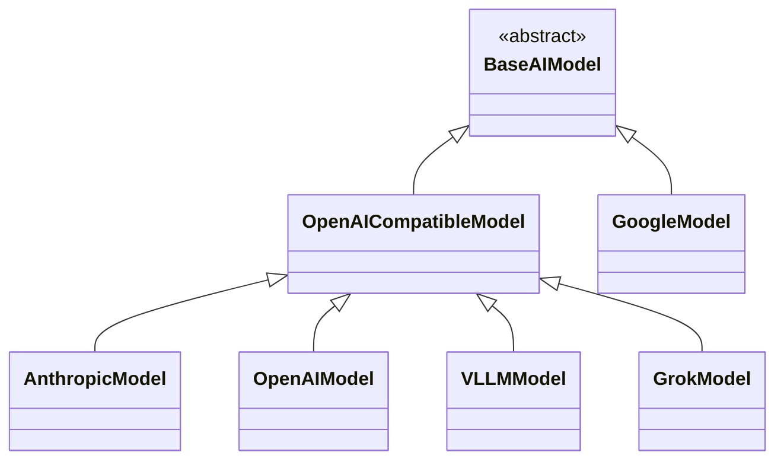
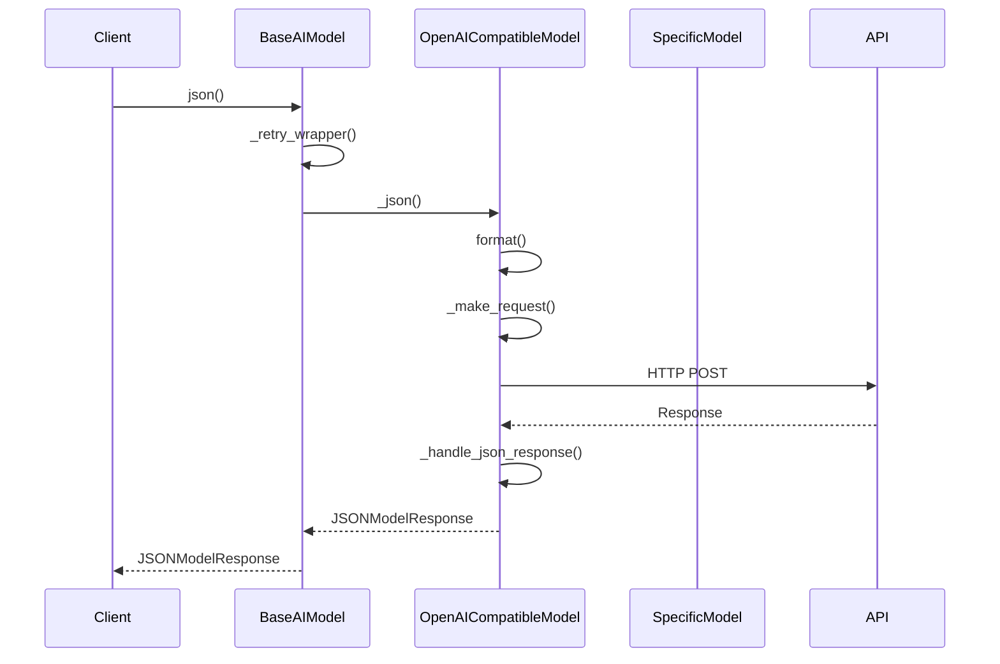

# ALEA LLM Client

[](https://badge.fury.io/py/alea-llm-client)
[](https://opensource.org/licenses/MIT)
[](https://pypi.org/project/alea-llm-client/)

This is a simple, two-dependency (`httpx`, `pydantic`) LLM client for ~OpenAI APIs like:
 * OpenAI
 * Anthropic
 * VLLM
 * Grok
 * Gemini (Google Vertex)

### Supported Patterns

It provides the following patterns for all endpoints:
 * `complete` and `complete_async` -> str via `ModelResponse`
 * `chat` and `chat_async` -> str via `ModelResponse`
 * `json` and `json_async` -> dict via `JSONModelResponse`
 * `pydantic` and `pydantic_async` -> pydantic models

### Default Caching

**Result caching is enabled by default for all methods.**

To disable caching, you can either:
  * set `ignore_cache=True` for each method call (`complete`, `chat`, `json`, `pydantic`)
  * set `ignore_cache=True` as a kwarg at model construction

Cached objects are stored in `~/.alea/cache/{provider}/{endpoint_model_hash}/{call_hash}.json`
in compressed `.json.gz` format.  You can delete these files to clear the cache.

### Authentication

Authentication is handled in the following priority order:
 * an `api_key` provided at model construction
 * a standard environment variable (e.g., `ANTHROPIC_API_KEY` or `OPENAI_API_KEY`)
 * a key stored in `~/.alea/keys/{provider}` (e.g., openai, anthropic)

### Streaming

Given the research focus of this library, streaming generation is not supported.  However,
you can directly access the `httpx` objects on `.client` and `.async_client` to stream responses
directly if you prefer.

## Installation

```bash
pip install alea-llm-client
```

## Examples


### Basic JSON Example

```python
from alea_llm_client import VLLMModel

if __name__ == "__main__":
    model = VLLMModel(
        endpoint="http://my.vllm.server:8000",
        model="meta-llama/Meta-Llama-3.1-8B-Instruct"
    )

    messages = [
        {
            "role": "user",
            "content": "Give me a JSON object with keys 'name' and 'age' for a person named Alice who is 30 years old.",
        },
    ]

    print(model.json(messages=messages, system="Respond in JSON.").data)

# Output: {'name': 'Alice', 'age': 30}
```

### Basic Completion Example with KL3M

```python
from alea_llm_client import VLLMModel

if __name__ == "__main__":
    model = VLLMModel(
        model="kl3m-1.7b", ignore_cache=True
    )

    prompt = "My name is "
    print(model.complete(prompt=prompt, temperature=0.5).text)

# Output: Dr. Hermann Kamenzi, and
```

### Pydantic Example
```python
from pydantic import BaseModel
from alea_llm_client import AnthropicModel, format_prompt, format_instructions

class Person(BaseModel):
    name: str
    age: int

if __name__ == "__main__":
    model = AnthropicModel(ignore_cache=True)

    instructions = [
        "Provide one random record based on the SCHEMA below.",
    ]
    prompt = format_prompt(
        {
            "instructions": format_instructions(instructions),
            "schema": Person,
        }
    )

    person = model.pydantic(prompt, system="Respond in JSON.", pydantic_model=Person)
    print(person)

# Output: name='Olivia Chen' age=29
```


## Design

### Class Inheritance



### Example Call Flow



## License

The ALEA LLM client is released under the MIT License. See the [LICENSE](LICENSE) file for details.

## Support

If you encounter any issues or have questions about using the ALEA LLM client library, please [open an issue](https://github.com/alea-institute/alea-llm-client/issues) on GitHub.

## Learn More

To learn more about ALEA and its software and research projects like KL3M and leeky, visit the [ALEA website](https://aleainstitute.ai/).
