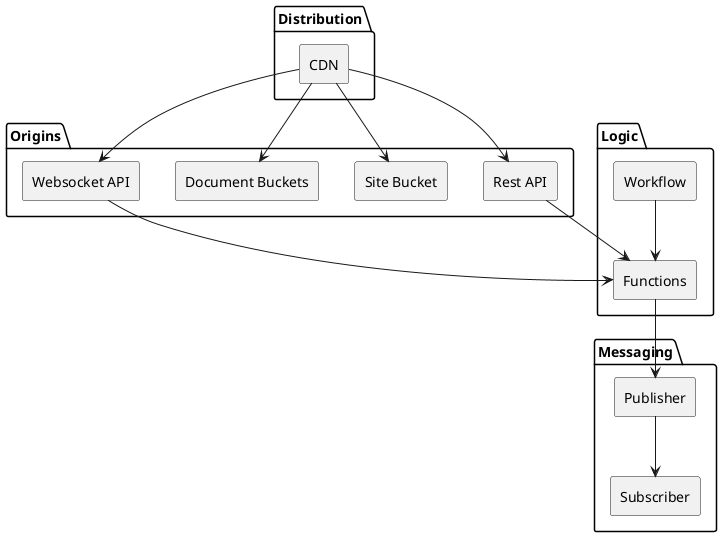

# Cloud Foundry

Cloud Foundry is a curated collection of components that can be assembled to build cloud-centric applications.

# Component Library

Cloud Foundry compoenents are organized into four catagories.


* **Distribution:**
* * **CDB** - content delivery can be connected to multiple origins (Rest API, Site Bucket, Document Buckets, and WebSocket API).
* **Origins:**
Elements in this layer provide content, consists of backend resources like
* * **Rest API**,
* * **Site Bucket**
* * **Document Bucket**
* * **WebSocket API**
, which are the origins that CloudFront interacts with.
* **Logic:** Application logic is implemented using Functions or Workflows
* * **Functions** Performe atomic operations or processes.
* * **Workflows** handles longer processes that span multiple operations.
* **Messaging:** Asynchronous communication is handled by messaging services. Elements provided follow a pub-sub model allowing.
* * **Publisher**
* * **Subscriber**

## Set Up

To get started, you can import the package and use it within your Pulumi project. Below is an example demonstrating how to deploy an AWS REST API along with a Lambda function using Cloud Foundry components.

## Hello World Example

The following example deploys an AWS REST API along with a Lambda function that returns a greeting message.  This implementation consists of three parts.  The API specification, the Function handler, and the Cloud Foundry deployment code.


### 1. API Specification

The first component required to build a REST API with Cloud Foundry is the API specification. This OpenAPI specification serves as the foundation for the API.
When constructing a REST API, integrations with functions must be linked to the path operations defined in the API specification. Additionally, authorizer functions can be associated with the API to provide authentication and authorization for these path operations.

In this example the API specification is a single path operation `/greet`.  This operation accepts an optional query parameter `name` and returns a greeting message. If the `name` parameter is not provided, it defaults to "World."

```yaml
# api_config.yaml
openapi: 3.0.3
info:
  description: A simple API that returns a greeting message.
  title: Greeting API
  version: 1.0.0
paths:
  /greet:
    get:
      summary: Returns a greeting message.
      description: |
        This endpoint returns a greeting message. It accepts an optional
        query parameter `name`. If `name` is not provided, it defaults to "World".
      parameters:
        - in: query
          name: name
          schema:
            type: string
          description: The name of the person to greet.
          example: John
      responses:
        200:
          description: A greeting message.
          content:
            application/json:
              schema:
                type: object
                properties:
                  message:
                    type: string
                    description: The greeting message.
                    example: Hello, John!
        400:
          description: Bad Request - Invalid query parameter.
          content:
            application/json:
              schema:
                type: object
                properties:
                  error:
                    type: string
                    description: A description of the error.
                    example: Invalid query parameter
```

### 2. Lambda Function

In this step, we implement the logic for the path operations of our API.

For the example application, this logic is handled by a Python Lambda function that implements the `/greet` API endpoint. The function retrieves the `name` parameter from the query string and returns a greeting message in JSON format.

```python
# app.py
import json

def handler(event, context):
    print(f"event: {event}")
    # Extract the 'name' parameter from the query string; default to 'World'
    name = (event.get("queryStringParameters", None) or {}).get("name", "World")

    # Return a JSON response with the greeting message
    return {
        "statusCode": 200,
        "body": json.dumps({
            "message": f"Hello, {name}!"
        }),
        "headers": {
            "Content-Type": "application/json"
        }
    }
```

### 3. Deploying with Cloud Foundry

The final step in implementing the API is deploying it using Cloud Foundry.

For the example, we need to create a Python function and then set up a `REST_API` with an integration that connects the function to the specified path operation.

Cloud Foundry simplifies much of the process for building functions. For Python functions, you typically only need to specify the sources and requirements. Cloud Foundry then takes care of assembling and deploying the function automatically.

For instance, the function for the `/greet` path operation can be defined as:

```python
greet_function = cloud_foundry.python_function(
    "greet-function",
    sources={"app.py": "./greet_app.py"}
)
```

In this example, Cloud Foundry copies the file `./greet_app.py` into the function code as `app.py` during the build process.

> Cloud Foundry offers default settings such as the handler, memory size, and others, which can be customized as needed.

Next, we set up a Cloud Foundry `rest_api`. Here, we provide the `api_spec.yaml` file and define an integration between the `/greet` path operation and the `greet-function`. The function is defined inline within the integration.

The complete REST API deployment looks like this:

```python
# __main__.py
greet_api = cloud_foundry.rest_api(
    "greet-oauth-api",
    body="./api_spec.yaml",
    integrations=[
        {
            "path": "/greet",
            "method": "get",
            "function": cloud_foundry.python_function(
                "greet-function",
                handler="app.handler",
                sources={"app.py": "./greet_app.py"}
            ),
        },
    ],
)
```


## Conclusion

Cloud Foundry simplifies the process of deploying cloud-native applications by providing easy-to-use components for defining REST APIs and Lambda functions. This example demonstrates how to deploy a basic API that returns a greeting message using Pulumi and Cloud Foundry.

# Cloud Foundry API Reference

## `Function` (Component Resource)

The `Function` class creates an AWS Lambda function resource with additional configuration options, such as memory size, timeout, environment variables, and optional VPC configuration. This class allows creating a new Lambda function or importing an existing one based on the provided parameters.

### Example Usage

```python
import pulumi
from cloud_foundry.function import Function

# Example of creating a new Lambda function
lambda_function = Function(
    name="my-lambda-function",
    archive_location="path/to/lambda-code.zip",
    handler="app.handler",
    runtime="python3.9",
    memory_size=256,
    timeout=60,
    environment={"MY_ENV_VAR": "my-value"},
    vpc_config={
        "subnet_ids": ["subnet-12345678", "subnet-87654321"],
        "security_group_ids": ["sg-12345678"]
    }
)
```

### Constructor

```python
def __init__(
    self,
    name: str,
    *,
    archive_location: str = None,
    hash: str = None,
    runtime: str = None,
    handler: str = None,
    timeout: int = None,
    memory_size: int = None,
    environment: dict[str, str] = None,
    actions: list[str] = None,
    vpc_config: dict = None,
    opts=None,
)
```

#### Parameters

- `name` (`str`) – The name of the Lambda function. This will be used as part of the function's identifier.

- `archive_location` (`str`, optional) – Path to the zip file containing the Lambda function's code.

- `hash` (`str`, optional) – A hash of the Lambda function's code to manage changes.

- `runtime` (`str`, optional) – The runtime environment for the Lambda function (e.g., `python3.9`).

- `handler` (`str`, optional) – The handler method to be used as the entry point for the Lambda function (e.g., `app.handler`).

- `timeout` (`int`, optional) – The amount of time that Lambda allows a function to run before stopping it. The default is 3 seconds.

- `memory_size` (`int`, optional) – The amount of memory (in MB) allocated to the Lambda function. The default is 128 MB.

- `environment` (`dict[str, str]`, optional) – Key-value pairs of environment variables to set for the Lambda function.

- `actions` (`list[str]`, optional) – A list of additional IAM actions to be included in the Lambda function's execution role.

- `vpc_config` (`dict`, optional) – Configuration for the VPC settings of the Lambda function, such as:
  - `subnet_ids` (`list[str]`) – The list of subnet IDs for the VPC configuration.
  - `security_group_ids` (`list[str]`) – The list of security group IDs for the VPC configuration.

- `opts` (`pulumi.ResourceOptions`, optional) – Additional options that control the behavior of this resource.

#### Properties

- `invoke_arn` (`pulumi.Output[str]`) – The ARN of the Lambda function's invoke URL.

- `function_name` (`pulumi.Output[str]`) – The name of the created Lambda function.

### Methods

### `function` Helper Method

The `function` helper method provides a simplified interface to create a new Lambda function using the `Function` class.

```python
def function(
    name: str,
    *,
    archive_location: str = None,
    hash: str = None,
    runtime: str = None,
    handler: str = None,
    timeout: int = None,
    memory_size: int = None,
    environment: dict[str, str] = None,
    actions: list[str] = None,
    vpc_config: dict = None,
    opts=None,
) -> Function:
```

#### Example Usage

```python
import cloud_foundry

lambda_function = cloud_foundry.function(
    name="my-lambda-function",
    archive_location="path/to/lambda-code.zip",
    handler="app.handler",
    runtime="python3.9",
    memory_size=256,
    timeout=60,
    environment={"MY_ENV_VAR": "my-value"},
    vpc_config={
        "subnet_ids": ["subnet-12345678", "subnet-87654321"],
        "security_group_ids": ["sg-12345678"]
    }
)
```

#### Parameters

Refer to the `Function` constructor parameters, as the helper method accepts the same arguments and passes them to the `Function` class.

---

### Outputs

The Lambda function creates the following outputs:

- **`invoke_arn`** – The ARN that can be used to invoke the Lambda function.
- **`function_name`** – The name of the Lambda function.


### `python_function`

Creates an AWS Lambda function using Python with source code and dependencies packaged together.

The `python_function` component is responsible for creating and deploying an AWS Lambda function using Python source code. This function wraps the creation of a Lambda function by first packaging the source code and any required Python dependencies using the `PythonArchiveBuilder` and then deploying it via Pulumi's AWS Lambda resources.

#### Example Usage

```python
import pulumi
import cloud_foundry

# Create a Lambda function
lambda_function = cloud_foundry.python_function(
    name="example-function",
    handler="app.handler",  # Lambda handler function (app.py's handler function)
    memory_size=128,  # Memory size for the Lambda
    timeout=60,  # Timeout in seconds
    sources={
      "app.py": "./app.py",  # Source files
    },
    requirements = [
      "requests==2.27.1",  # Python package dependencies
    ],
    environment={
        "MY_ENV_VAR": "value",  # Environment variables for the Lambda
    },
)
```

#### Arguments

| Name           | Type             | Description                                                                                               |
|----------------|------------------|-----------------------------------------------------------------------------------------------------------|
| `name`         | `str`            | The name of the AWS Lambda function to create.                                                            |
| `handler`      | `str`, optional   | The entry point for the Lambda function, specified as `file_name.function_name`. Defaults to"app.handler"   |
| `memory_size`  | `int`, optional   | The memory allocated to the Lambda function in MB. Defaults to AWS Lambda's standard memory size.          |
| `timeout`      | `int`, optional   | The maximum amount of time that the Lambda function can run, in seconds. Defaults to AWS Lambda's timeout. |
| `sources`      | `dict[str, str]`, optional | A dictionary of source files or inline code to include in the Lambda. The keys are destination paths, and the values are the source file paths or inline code. |
| `requirements` | `list[str]`, optional | A list of Python package dependencies to include. These are installed and packaged with the function.     |
| `environment`  | `dict[str, str]`, optional | Environment variables to pass to the Lambda function.                                                    |

#### Returns

- `Function`: An instance of the `Function` class representing the deployed Lambda function, including properties like `invoke_arn` and `function_name`.

#### Components

- **`PythonArchiveBuilder`**: Packages the Python source files and dependencies into a deployable archive for the Lambda function.
- **`Function`**: A Pulumi `ComponentResource` that defines and manages the AWS Lambda function deployment.

#### Attributes

| Name            | Description                                                        |
|-----------------|--------------------------------------------------------------------|
| `invoke_arn`    | The ARN used to invoke the deployed Lambda function.               |
| `function_name` | The name of the deployed Lambda function.                          |

#### Resources Created

- **AWS Lambda Function**: A new Lambda function created with the given source files, dependencies, memory size, timeout, handler, and environment variables.
- **IAM Role**: The required IAM role is created to grant the Lambda function execution permissions.

#### Notes

- **Memory Size and Timeout**: You can customize the memory size and timeout for the Lambda function. AWS charges are affected by these values.
- **Sources and Requirements**: The `sources` argument is used to include Python source code, and `requirements` is used to specify the dependencies to be installed in the Lambda function environment.
- **Environment Variables**: The `environment` argument allows you to set environment variables for the Lambda function at runtime.

#### See Also

- [Pulumi AWS Lambda Function](https://www.pulumi.com/docs/reference/pkg/aws/lambda/function/)
- [AWS Lambda Documentation](https://docs.aws.amazon.com/lambda/)

# RestAPI (ComponentResource)

The `RestAPI` class is a Pulumi component resource that allows you to create and manage an AWS API Gateway REST API with Lambda integrations and authorizers.

This component takes one or more OpenAPI specification and attaches Lambda functions to the API path operations as integrations. It also supports Lambda authorizers for authentication and authorization.

## Example Usage

```python
import pulumi
import cloud_foundry

# Create the REST API
greet_api = cloud_foundry.rest_api(
    name="greet-api",
    body="./api_spec.yaml",
    integrations=[
      {
        "path": "/greet",
        "method": "get",
        "function": cloud_foundry.python_function(
            name="greet-function",
            handler="app.handler",
            sources={"app.py": "./greet_app.py"},
        ),
      }
    ],
    authorizers=[
      {
        "name": "token-authorizer",
        "type": "token",
        "function": cloud_foundry.import_function("token-authorizer"),
      }
    ]
)
```

## Constructor

### RestAPI(name, body, integrations=None, authorizers=None, opts=None)

Creates a new `RestAPI` component.

### Parameters

- `name` (str) - The name of the REST API.
- `body` (Union[str, list[str]]) - The OpenAPI specification file path or the content of the OpenAPI spec. This can be a string representing a file path or YAML content.
- `integrations` (Optional[list[dict]]) - A list of Lambda function integrations for specific path operations in the API. Each integration is a dictionary containing:
  - `path` (str): The API path to integrate with the Lambda function.
  - `method` (str): The HTTP method for the path.
  - `function` (cloud_foundry.Function): The Lambda function to be integrated with the API path.
- `authorizers` (Optional[list[dict]]) - A list of Lambda authorizers used for authentication in the API. Each authorizer is a dictionary containing:
  - `name` (str): The name of the authorizer.
  - `type` (str): The type of authorizer (e.g., `token`).
  - `function` (cloud_foundry.Function): The Lambda function used for the authorizer.
- `opts` (Optional[pulumi.ResourceOptions]) - Options to control the resource's behavior.

### Example

```python
rest_api = RestAPI(
    name="example-api",
    body="./api_spec.yaml",
    integrations=[
        {
            "path": "/hello",
            "method": "get",
            "function": cloud_foundry.python_function(
                name="hello-function",
                handler="app.handler",
                sources={"app.py": "./hello_app.py"},
            ),
        }
    ],
    authorizers=[
        {
            "name": "oauth-authorizer",
            "type": "token",
            "function": cloud_foundry.import_function("oauth-authorizer"),
        }
    ]
)
```

## Methods

# rest_api (Helper Function)

The `rest_api` function simplifies the creation of an API Gateway REST API by using the `RestAPI` component. It also automatically exports the API Gateway host and API ID.

## Example Usage

```python
import pulumi
from cloud_foundry.rest_api import rest_api

# Define Lambda function integration for the "/greet" path
integrations = [
    {
        "path": "/greet",
        "method": "get",
        "function": cloud_foundry.python_function(
            name="greet-function",
            handler="app.handler",
            sources={"app.py": "./greet_app.py"},
        ),
    }
]

# Create the API Gateway REST API
greet_api = rest_api(
    name="greet-api",
    body="./api_spec.yaml",
    integrations=integrations,
)
```

## Parameters

- `name` (str) - The name of the REST API.
- `body` (str) - The OpenAPI specification file path. This can be a string or YAML content.
- `integrations` (Optional[list[dict]]) - A list of Lambda function integrations for the API paths.
- `authorizers` (Optional[list[dict]]) - A list of Lambda authorizers for the API.

### Example

```python
greet_api = rest_api(
    name="greet-api",
    body="./api_spec.yaml",
    integrations=[
        {
            "path": "/greet",
            "method": "get",
            "function": cloud_foundry.python_function(
                name="greet-function",
                handler="app.handler",
                sources={"app.py": "./greet_app.py"},
            ),
        }
    ],
)
```

## Outputs

- `name-id` (str) - The ID of the created API Gateway REST API.
- `name-host` (str) - The host URL of the created API Gateway REST API.
