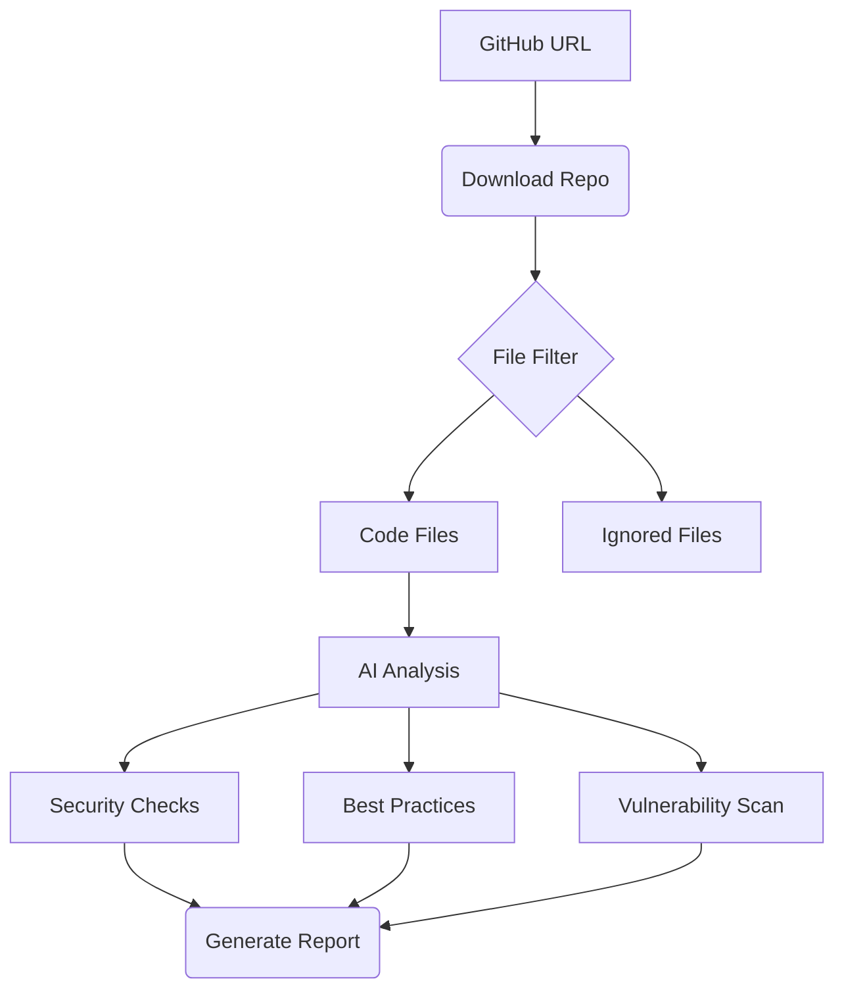

# Code Analyzer 🔍 | AI-Powered Security Analysis

[](https://pypi.org/project/code-analyzer-b/)
[](https://pypi.org/project/code-analyzer-b/)
[](https://opensource.org/licenses/MIT)
[](https://pepy.tech/project/code-analyzer-b)

**Code Analyzer** is an intelligent security scanning tool that leverages DeepSeek's AI to identify vulnerabilities, code smells, and potential security risks in GitHub repositories.

```bash
pip install code-analyzer-b
```

## 🚀 Quick Start

### 1. Initial Setup
```bash
code_analyzer setup
🔑 Enter your DeepSeek API key: sk-xxxxxxxxxxxxxxxxxxxxxxxxxxxxxxxx
```

### 2. Analyze Repository
```bash
code_analyzer analyze https://github.com/yourusername/your-repo

# Sample Output
🔍 Starting analysis of https://github.com/yourusername/your-repo
📁 Found 127 files to analyze
Analyzing Files: 100%|████████████████| 127/127 [03:45<00:00]
📝 Critical Findings (3) | Warnings (7) | Recommendations (12)
```

## ✨ Key Features

- **Multi-Language Support** - Python, JS/TS, Java, C/C++, Go, Rust, PHP, Ruby
- **Smart Filtering** - Auto-ignore binaries, generated files, and large assets
- **AI-Powered Analysis** - Context-aware vulnerability detection
- **Prioritized Reporting** - Risk-level categorized findings
- **CI/CD Ready** - Simple CLI interface for automation

## 📚 Documentation


### Configuration Options
| Setting              | Default        | Description                          |
|----------------------|----------------|--------------------------------------|
| `MAX_FILE_SIZE`      | 5MB            | Maximum file size to analyze         |
| `REQUEST_TIMEOUT`    | 30s            | API request timeout                  |
| `SUPPORTED_EXT`      | 15+ extensions | File types to analyze                |

Edit configuration at:  
`~/.code_analyzer/config.ini`

## 🛠 How It Works



## 🌐 Supported Languages

| Language       | Extensions           | Security Checks               |
|----------------|----------------------|-------------------------------|
| Python         | `.py`                | SQLi, XSS, dependency risks   |
| JavaScript/TS  | `.js`, `.ts`         | Prototype pollution, XSS      |
| Java           | `.java`              | Insecure deserialization      |
| C/C++          | `.c`, `.cpp`         | Buffer overflow, memory leaks |
| Go             | `.go`                | Goroutine leaks, race conditions |
| Rust           | `.rs`                | Unsafe code, memory safety    |

## 🔒 Security & Ethics

1. **Data Handling**:
   - Temporary repository clones are deleted after analysis
   - No code storage or telemetry collection
   - API keys encrypted in configuration

2. **Ethical Use**:
   - Only analyze repositories you own/have permission to scan
   - Do not use for malicious purposes
   - Respect software licenses and intellectual property

## ❓ FAQ

**Q: How does this differ from static analysis tools?**  
A: Combines traditional SAST with AI context awareness for fewer false positives

**Q: Analysis taking too long?**  
```bash
code_analyzer analyze URL --exclude tests,examples,dist
```

**Q: Seeing API key errors?**  
```bash
rm ~/.code_analyzer/config.ini && code_analyzer setup
```

## 🤝 Contributing

We welcome contributions! Please see our [Contribution Guidelines](CONTRIBUTING.md) for:
- Feature requests
- Bug reports
- Documentation improvements
- Code contributions

## 📜 License

MIT License - See [LICENSE](LICENSE) for full text

---
