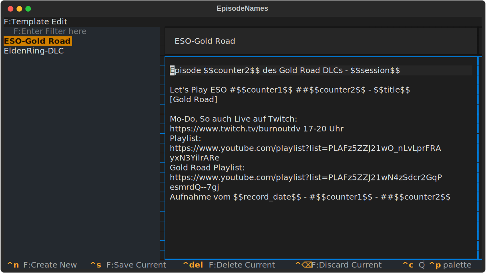

# EpisodeNames - a copy paste experience

This is a needlessly complicated tool for a simple job.

The situation was as follows: since 14 years, I _create_ YouTube videos, mostly start-stop lets plays that honestly barely anyone watches. But, I do care and its a good way to get single player games done. Anyway, what I also care about is a proper naming scheme and numbering of all those videos and their description. Over the years I amassed over 10000 videos. My biggest project is Elder Scrolls Online which alone will reach 2000 Videos soon. The naming scheme for each episode is quite complicated and i have to iterate some numbers for every single video, some for sessions.

The solution is this overengineered piece of _equipment_:


tl;dr: this is a textual testing ground *slash* pattern mine for future projects. *Think Factorio when you first build a base to have the resource to get to the real base*

On the left a tree view with _all_ my projects, on the right the currently active view of all the episodes. A simple key combination copies the assigned template text to the clipboard (using `pyperclip` currently). There is also a screen to edit templates and projects.

If this is the only thing I wanted I could have just used some scripts that use an SQLite database directly and I would have inputed the data via an database explorer. Or some pre-fabbed input mask. **But** i like TUIs and I cannot lie.

So here we are now, mostly this is a big learning experience for me to try different TUI design patterns.



Currently I got ModalScreens, ScreenModes, Notify and one TextArea going for me. There is some other experimentation as well. I use the `peewee`ORM for this one, I never touched it before and I saw it in some random project and wanted to try it. I am not so sure if its the right way, but I hope my software stack is sound and allows, if the need arises, to replace everything under the hood.

## How to install

1. Check out git
2. Change to folder
3. Create virtual environment `$ python3 -m venv venv`
4. Activate venv `$ source venv/bin/activate`
5. `$ pip install -e .` for editable module installation, this should, hopefully resolve all dependencies
6. `$ python3 episode_names/Utility/order.py` to create dummy data
7. `$ python3 episode_names/app.py`

_Or, theoretically_ it should now also work with UV, if I got all the things right and haven't configured it horribly

```bash
uv tool run episode-names
```

## Todos

- [X] Making the entire workflow in interface possible
  - [x] Creating, Editing, Deleting Templates
  - [x] Assigning Templates to Episodes
  - [x] Creating Projects
- [ ] Logic functions that keep internal numbering consistent
- [ ] Styling - different colors than default _partially solved by textual 0.86?_
- [X] Import/Export of data
- [ ] Use proper tools for i18n and not some thrown together gobbligob
- [X] Use proper user folders
- [ ] add some cli flags for db folders and stuff (user profiles? why though?)
- [ ] rearrange files by screens and modals
- [ ] make project tree view more sophisticated
- [ ] sort projects by episode edited data and category alphabetical
- [ ] revamp database scheme, currently everything is NotNull and got no defaults in SQL
- [ ] Hide/Show Keyboard shortcuts in EpisodeScreen based on currently active modal
- [ ] Make it so that the db connector does not create objects that are basically empty / work more with SQL restraints
- [ ] Selected Export for only parts of the projects

## Ideas

- [ ] Import of all existing stuff I got on YouTube, separate descriptions from rest and make this the one-stop management solution for all my videos
- [ ] Find title duplicates
- [ ] save additional meta data
- [ ] make the interface more sleek and faster to use for the haxxor experience
- [ ] hide currently not relevant keyboard shortcuts
- [ ] I am currently loading all Episodes from the database multiple times to populate views. This should always be fast even if I had thousands of entries..yet, maybe I should still cache those and only update deltas when needed? It would be way more complicated, but, as an exercise, better

## Know Issues

* Cannot duplicate template yet
* For some reason I broke the scroll ability of my main Datatable that contains the episodes, I added a ScrollView but this should not be necessary
* Some number inconsistency, sometimes -1 is assigned which is a bad way
* Per default, a new project has no template assigned, which might go haywire. Currently, dummy data creates a manual template 0 which should sidestep this
* Crash when creating template with empty project
* The project tree view has no scroll bar...