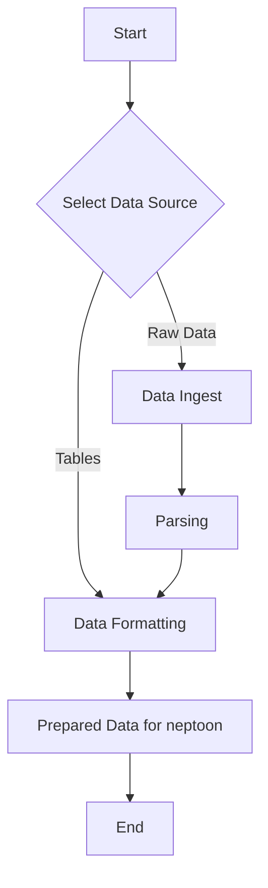

# Data Collection and Formatting

## Introduction

Data collection and formatting are crucial first steps in using neptoon. This section will explain the process of acquiring and preparing your data for use with neptoon, whether you're a sensor owner with raw data files or a researcher working with publicly available datasets.

## Why is this step important?

Proper data collection and formatting ensure that:
: 1. Your data is in a structure that neptoon can process efficiently.
2. Subsequent analysis and processing steps in neptoon will run smoothly.

Many different organisations are interested in using CRNS and this leads to numerous different data formats.
### Sensor Owners
If you own or operate a CRNS, you likely have raw sensor files that need to be parsed and formatted. neptoon provides tools to streamline this process, converting your raw data into a structured format ready for processing.
### Researchers, Students, and Citizen Scientists
For those working with CRNS data that has already been structured (e.g., it's in a `csv` format), neptoon offers methods to format such data ready for processing. We additionally provide methods which support efficiently formatting some of the publicly available datasets available through different organisations. 

## Process Flowchart

Depending on what kind of data your working with might change.



!!! tip "Section Selection"
	- For File Collection see [here](#)
	- For Data Formatting see [here](#)

## Working with configuration files

Like everything in neptoon, it is possible to use pre-configured configuration files which automatically supply the settings for neptoon, allowing replicable data processing. Here we describe how to do this, as it is the most efficient way of using neptoon. More detailed descriptions on using neptoon directly, for example in a Jupyter notebook, are outlined below for those who wish to do this.

If you want to import and format your data using a yaml file - first you make sure the configuration file is appropriately filled out (see [here](intro-to-config.md) for more information on that). After this you run the following code

```python
from neptoon.data_ingest_and_formatting import CollectAndParseRawData

data_creator = CollectAndParseRawData(
						path_to_yaml="path/to/your_yaml.yaml"
)

crns_df = data_creator.create_data_frame()
```

The code will use the provided information in the YAML file to parse, format and produce a DataFrame ready for use in `neptoon`.

Below we will outline how you might use the available methods in neptoon to ingest and format data in your python IDE. The quickest way will always be the YAML file method, however we understand there could be instances where building these pipelines manually is preferred. 
## Data Ingest

### Raw Data

- 
- File Collection
- Parsing

### Public Data
(WIP)

## Data Formatting


1. Options
2. Adding Columns-metadata manually
3. Time Zones
