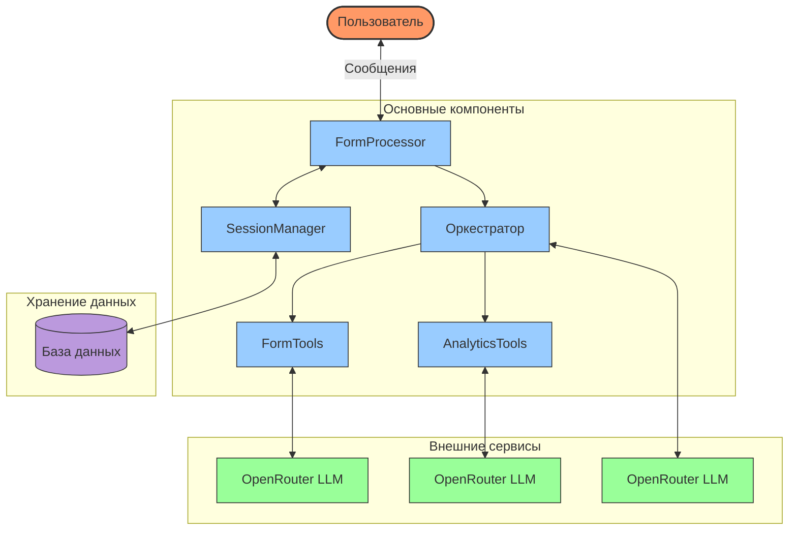
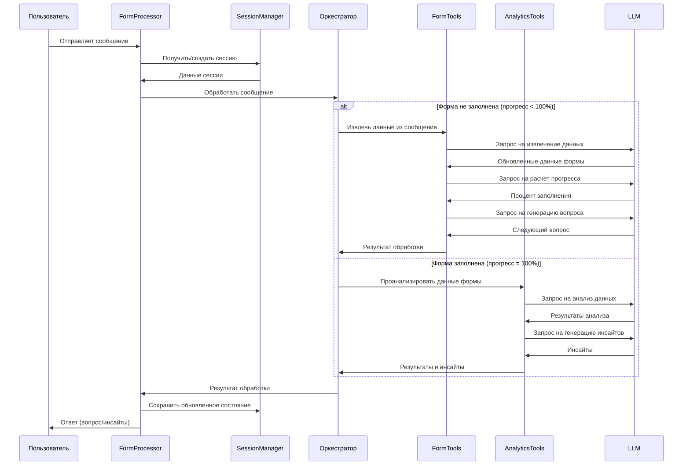
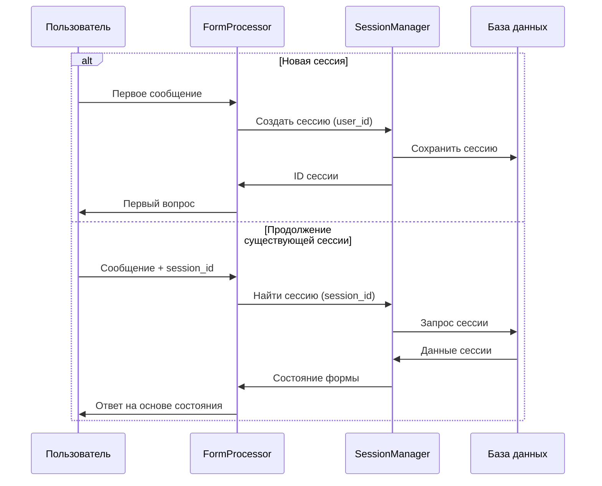
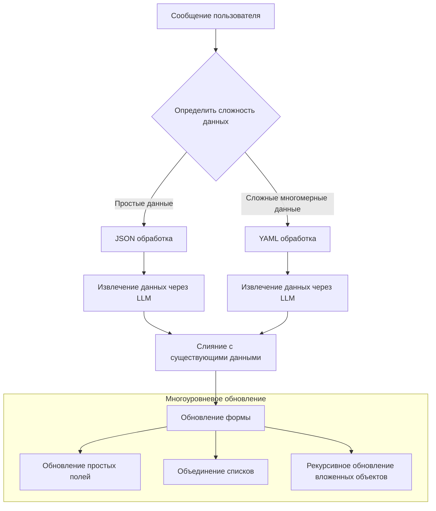
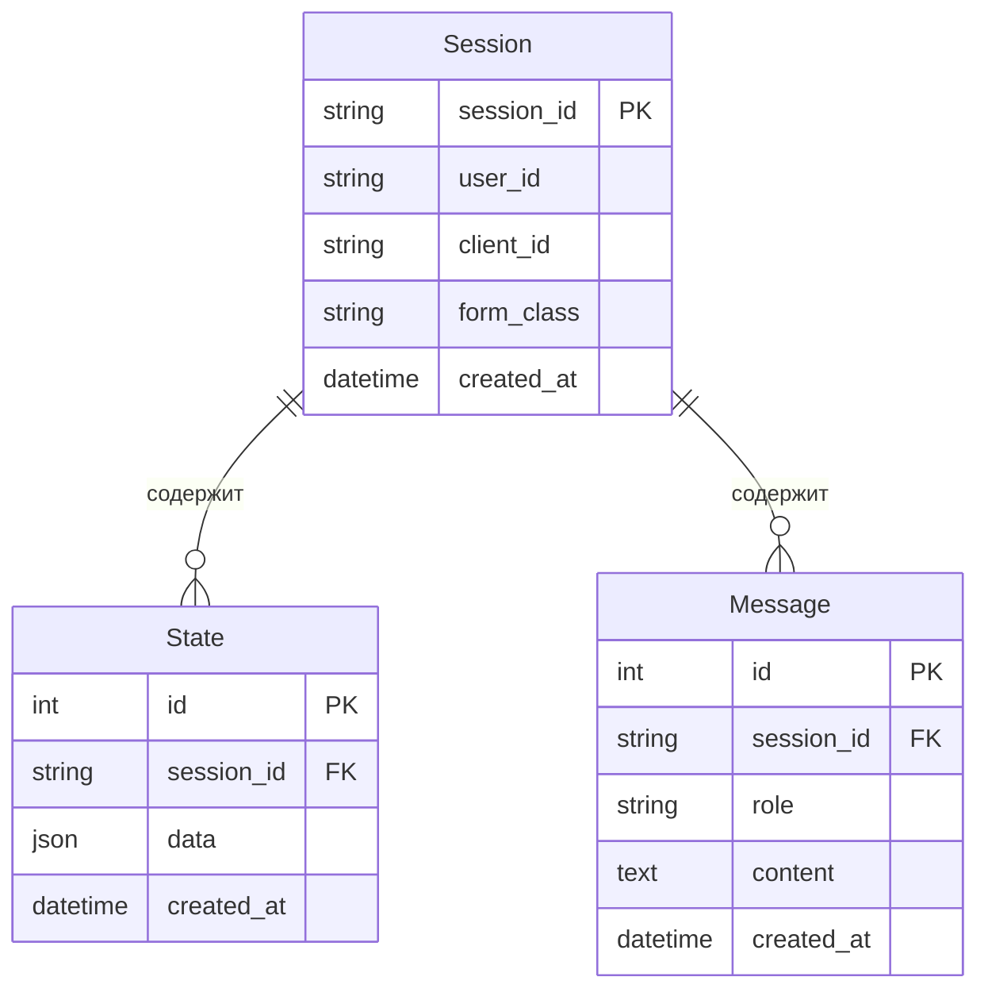
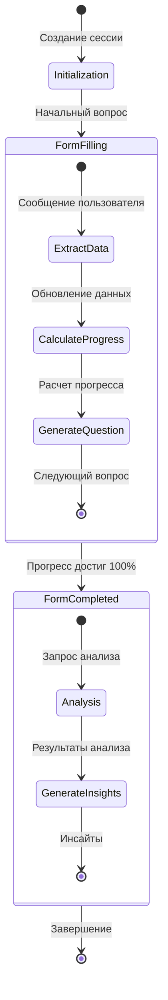
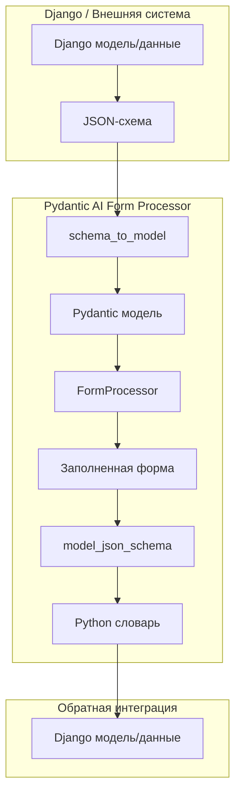
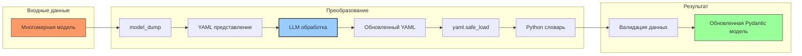
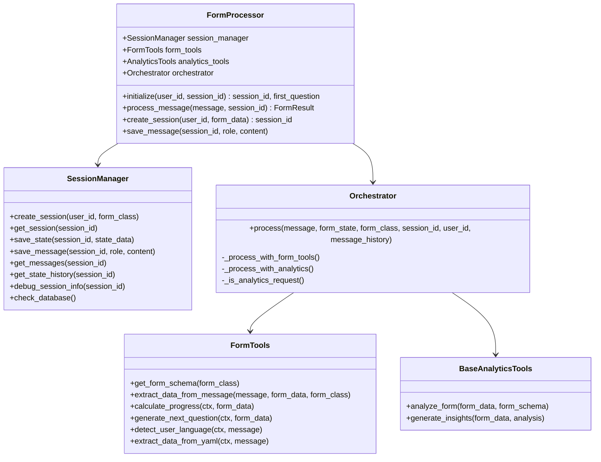
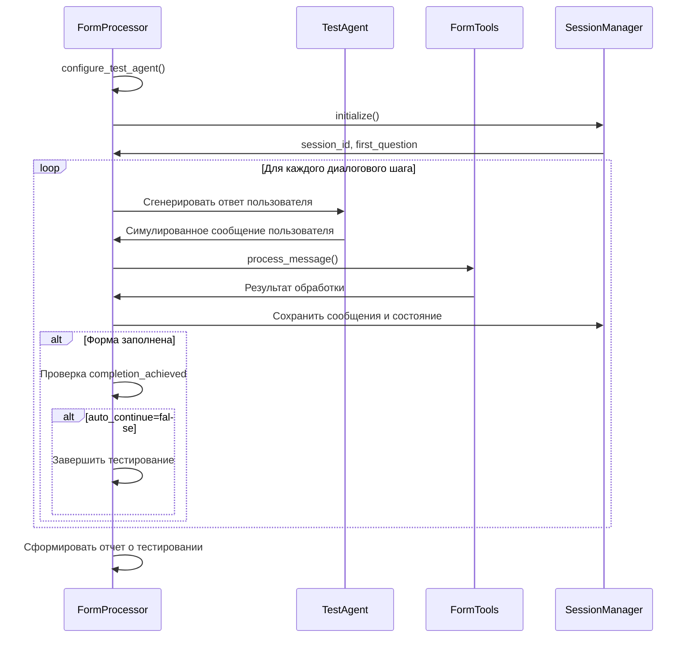

# Pydantic AI Form Processor - Схемы и Диаграммы

> Визуализация процессов, архитектуры и потоков данных системы интеллектуального заполнения форм

## Общая архитектура системы

## Процесс обработки сообщений

## Процесс сессионного управления

## Извлечение данных и работа с многомерными структурами

## Архитектура данных

## Процесс создания и обработки формы

## Преобразование моделей и интеграция с внешними системами

## Обработка многомерных данных с использованием YAML

## Взаимодействие компонентов в FormProcessor

## Модель тестирования через тест-агенты

